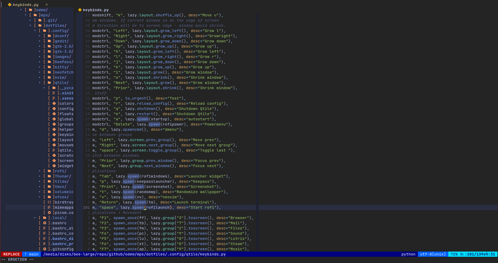

# My Perfect System (MPS)
The System is a collection of scripts and configurations to turn a vanilla
Debian installation into the system i like to work with.
Generally, all dedicated installers are stored within the "installers" folder
and are categorized into certain catgeories building on top of each other:
- Bootstrap (Create User and sudo config)
- Terminal (Customizing the terminal, e.g. terminal, nvim, nerdfonts, etc.)
- Desktop (Customizing a qtile tiling window manager and related tools)
- Extras (Everything not fitting into the already mentioned categories)

Bash scripts to invoke groups of installers are porovided in the main folder.
Each installer might utilize data from either the dotfiles folder
which contains required configurations or the snippets folder
which contains general purpose bash scripts.

The scripts in the root folder allow rudimentary parameters
to be supplied to the installer scripts. As for example the username
or password being used for authentication.
Reasonable defaults are used wherever possible.

Example invocations:

```
./bootstrap.bash -u foo -p bar
./terminal.bash -u foo
./desktop.bash -u foo
./all.bash -u foo
```

Some Screenshots:

